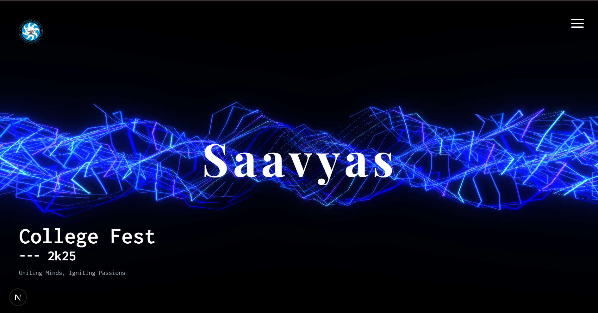
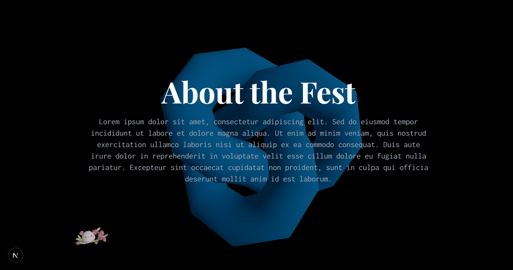
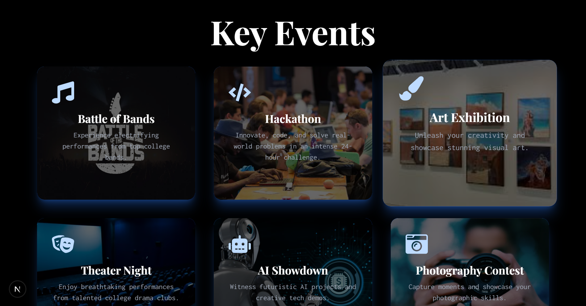
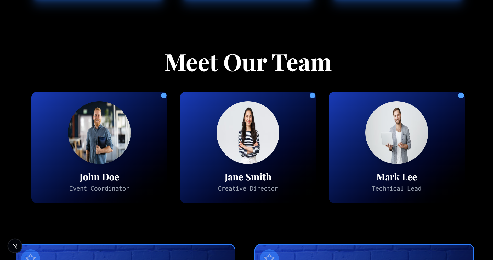
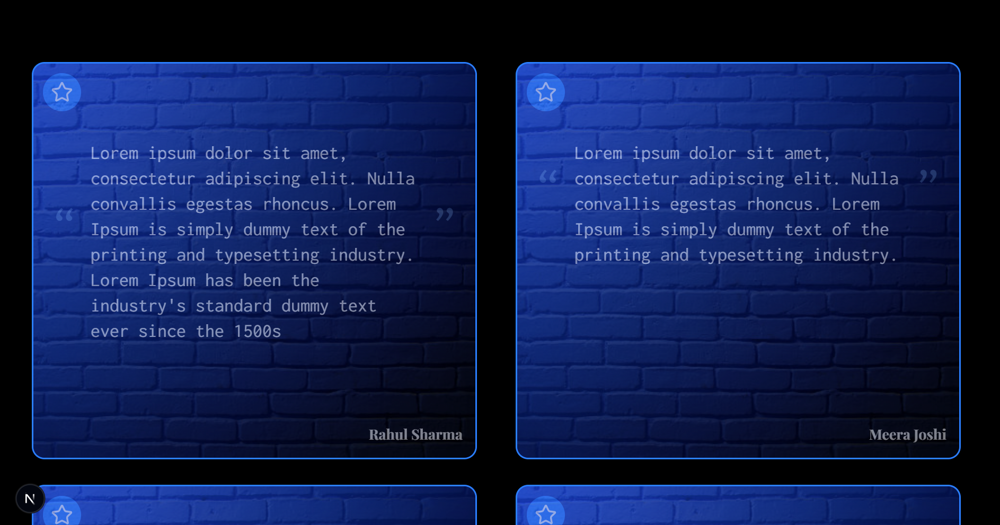
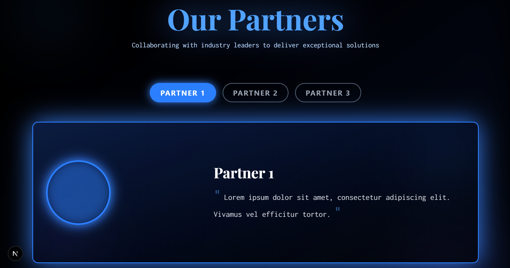
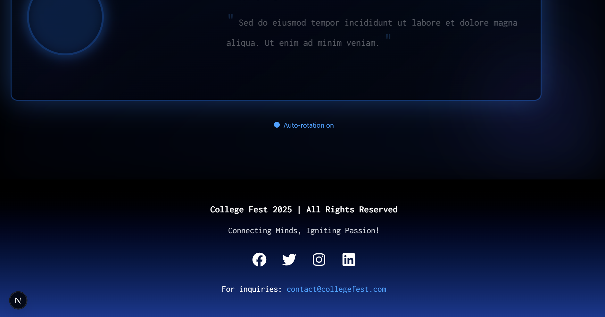

# College Fest Website

## Project Overview
This project is a dynamic and visually captivating website for some college fest, designed using Next.js, TypeScript, and Tailwind CSS. This project is basically for me to learn integration of 3D models into any project.

## Tech Stack
1. Next.js - For building the website with server-side rendering.<br>
2. TypeScript - For type safety and improved code structure.<br>
3. Tailwind CSS - For rapid and flexible styling.<br>
4. Three.js - For creating the 3D background in the hero section.<br>

## Getting Started

### Prerequisites
Ensure you have the following installed:<br>
1. Node.js (v18+ recommended)<br>
2. npm or yarn<br>

### Installation
1. Clone the repository:<br>
```
git clone https://github.com/yourusername/college-fest-website.git
cd college-fest-website
```

2. Install dependencies:<br>
```
npm install
```
or<br>
```
yarn install
```

### Running the Project
1. To start the development server:<br>
```
npm run dev
```
or<br>
```
yarn dev
```
Visit ``` http://localhost:3000 ``` to view the site.

## Screenshots of the website:







